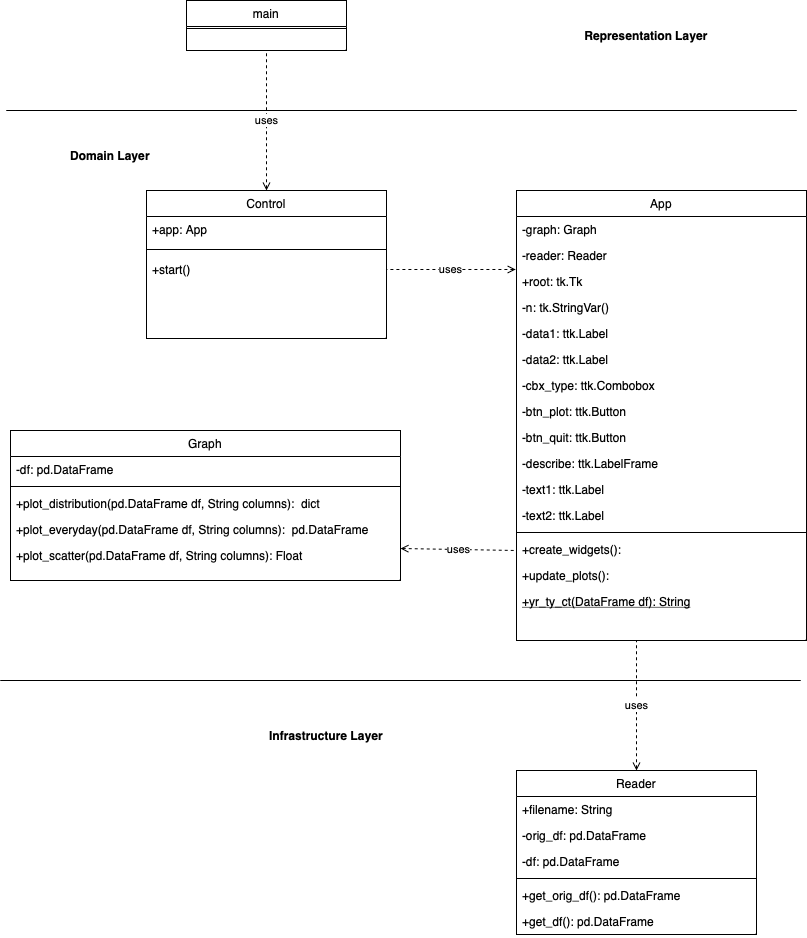

# Netflix Data Analysis
 
## Description
This application will allow users to plot graphs between TV shows and movies to see
the relationship between them. represent as a bar graph, line graph, or scatter plot.
to see the descriptive statistics of each distribution.

## Data Sources
[Netflix Movies and TV Shows](https://www.kaggle.com/datasets/shivamb/netflix-shows)

## Running the Application
dependencies (packages) needed to run your program
```
pip install pandas
pip install matplotlib
pip install numpy
pip install networkx
pip install seaborn
pip install scipy
```
Run the application using the following command:
``` 
python3 main.py
```
or
```
python main.py
```
 
## Design

In the diagram, I have a main class that will run the application.  
The main class will be called the Control class, which will be called the App class.  
The app class will call the graph class and the reader class.  
So Control classes act like facade patterns that organize the flow of the  
program between user and application.
 
## Design Patterns Used
Facade design pattern
 
## Graph Algorithm Used
Our project is to build an application that analyzes data from the listings of  
movies and TV shows on Netflix. If a user wants to watch a new movie but hasn't  
picked one yet, our app can suggest new movies that have the same genres as the  
ones they've watched before. We model the movie title as a graph problem as follows:

- There is a vertex for each Movie title. Assume there are n movies

- There is a directed edge p → q if movie have same genres assume as m related genres

- The associate value will be how many genres didn’t match  
(if all genres don’t match a single one, that node will not have edges)  

- We need to find the shortest path from one movie title to all nodes (Movie title)  

- We can solve this problem by using BreadthFirstSearch from lasted movie title,  
and output the distance array

The algorithm runs in O(V+E) = O(n+m) time

 
## Other Information
interesting libraries used in your project  
scipy.stats   
is used to calculate the correlation coefficient between two variables.  
matplotlib.backends.backend_tkagg  
is used to display the graph in the GUI.
